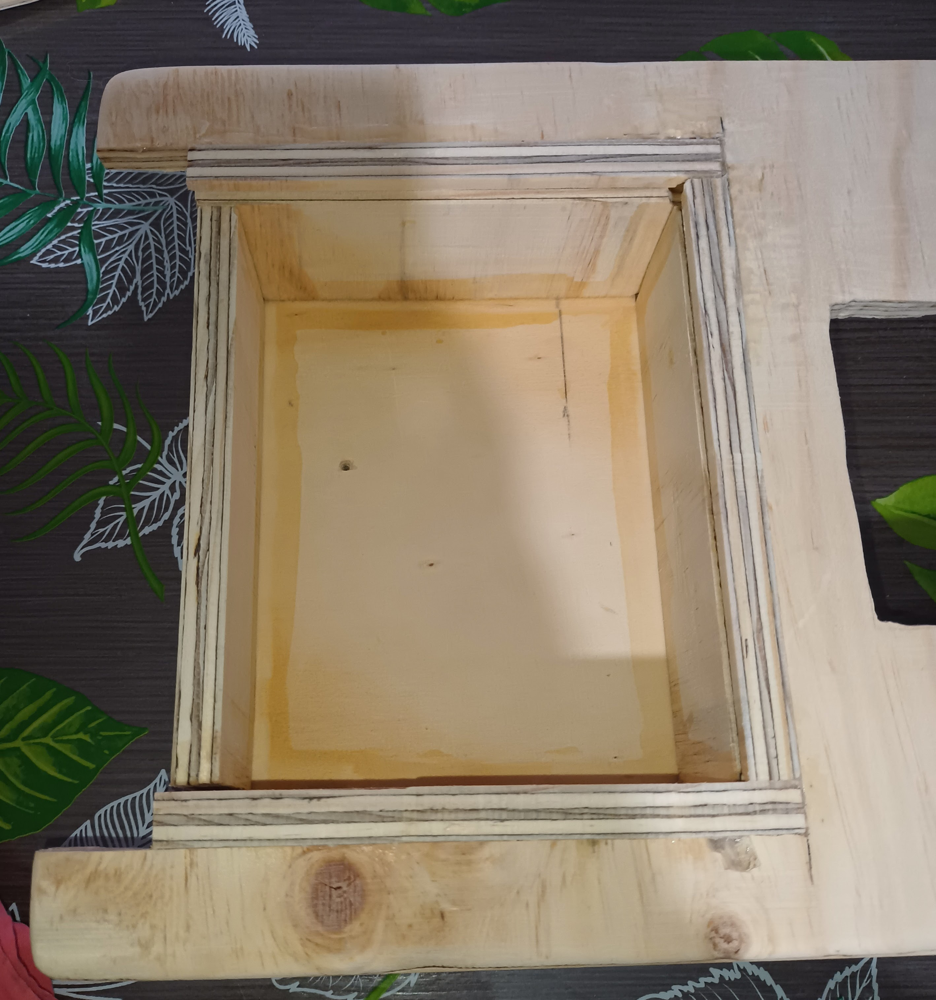

# Proyecto de Mesa de Extensión para Máquina de Coser Casera

Este repositorio contiene el proyecto final del curso de Fabricación Digital. Se diseñó una mesa de extensión específicamente para la máquina de coser casera Janome Sakura 95.

Las explicaciones sobre las piezas se basan en el documento `Piezas.pdf`, que muestra el número de pieza de cada parte del diseño.

## Resultado

## Archivos del Proyecto

En el repositorio se encuentran las siguientes carpetas y archivos:

- **origen**
  - **ensamble**
    - `proyecto_final`: archivo del ensamble final que referencia al resto de archivos.
    - **ensamble_cajon**: carpeta que contiene imágenes que muestran cómo se acoplan las piezas del cajón.
  - **fdm**: contiene los archivos de las piezas que se fabricaron con impresión 3D
    - **adaptador pata**: carpeta que contiene los archivos de la pieza número 8
    - **tirador**: carpeta que contiene los archivos de la pieza número 9
  - **img**: carpeta con archivos de imágenes usadas en este documento.
  - **router_cnc**: contiene los archivos de las piezas fabricadas por corte en router CNC
    - **cajon bottom**: carpeta que contiene los archivos de la pieza número 2
    - **cortes**: carpeta que contiene archivos de corte de las piezas del cajón base
    - **frontal**: carpeta que contiene los archivos de la pieza número 4
    - **lado 1**: carpeta que contiene los archivos de la pieza número 1
    - **lado 2**: carpeta que contiene los archivos de la pieza número 6
    - **mesa top**: carpeta que contiene los archivos de la pieza número 7
    - **posterior**: carpeta que contiene los archivos de la pieza número 3
    - **tapa**: carpeta que contiene los archivos de la pieza número 5
  - `Piezas.pdf`: archivo que muestra el número y tabla de piezas generada por el software Fusion360.

## Diseño

Se realizó el diseño del proyecto en el software Fusion 360. Los archivos se encuentran ordenados en las carpetas descritas anteriormente.

Se diseñó una mesa a medida de la máquina de coser Janome Sakura 95. El diseño contempla un cajón en la base que permite guardar accesorios de la máquina e implementos de costura.

Se numeran las piezas como sigue:

## Piezas, Materiales y Procesos de Fabricación

## Costos

Para realizar toda la estructura de la mesa se necesita:
- Una plancha de terciado de 12mm. Se necesita solo la mitad de la plancha estándar de 1,2x2,4m. El valor aproximado es de <a href="https://www.imperial.cl/terciados/terciado-estructural-12mm-120x240mt/product/76017">17.990 CLP</a>.
- 5 tornillos de 3x10mm. Un pack de 20 unidades costó 750 CLP.
- Filamento PLA. Las 4 piezas impresas en 3D utilizan 41g de filamento en total. Calculando en base a la referencia de <a href="https://cicla3d.cl/products/cicla-pla?variant=46081855357178">12.390 CLP</a> por Kg, el costo total de la impresión es de 508 CLP.
- Cola fría de madera, como pegamento. Se utiliza una cantidad muy pequeña, pero un sachet de 500g se encuentra a <a href="https://www.idepal.cl/cola-fria-doy-pack-500gr">1.990 CLP</a>.
- Barra de madera (cilindro) de 30mm. Se utilizó en total menos de 25cm en total de la barra. La única referencia de precio encontrada fue de de 2 barras de 30mmx1mt a <a href="https://articulo.mercadolibre.cl/MLC-536082012-barras-de-madera-de-coihue-lisas-30mm-x-1mt-2-u-_JM#position%3D15%26search_layout%3Dstack%26type%3Ditem%26tracking_id%3Daf9cde12-9041-4548-b144-a8558abbf742">12.800CLP</a>, sin embargo, se puede reutilizar un palo de escoba o cortina (mi caso) o imprimir la pieza en 3D.

## Ensamble

El ensamble general se encuentra en el archivo de `proyecto_final`.

Paso a paso:
1. Ensamblar la caja base uniendo con cola fría las piezas 1, 2, 3, 4 y 6. Deben calzar las ranuras en los bolsillos. Se adjuntan distintas vistas del proceso.
Vista superior 1.

Vista superior 2.

Vista inferior.

2. Unir a la parte superior de la caja base del paso 1 la pieza 7. Se puede pegar solo con cola fría o agregar clavos (en mi caso no fue necesario).

3. Unir con tornillos de 3x10mm la pieza 9 a la parte inferior de la pieza 5.
El tirador debe ir con el orificio de 2 profundidades hacia arriba, para ahí insertar el tornillo.

Tornillo 3x10mm.

Así queda:

4. Unir con tornillos de 3x10mm las piezas 8 a la parte inferior de la pieza 7, siguiendo la distancia del diseño del proyecto. Cortar un cilindro de madera de 30mm de diámetro en 3 piezas de largo 6.3mm, para utilizar como pieza 10. Luego insertar estas piezas en cada adaptador (pieza 8).
Adaptador atornillado:

Agregar pieza 10:

5. Deslizar la pieza 9 con la pieza 5 hacia abajo por las ranuras del cajón base armado en el paso 1.

6. Lijar toda la pieza con lija de madera hasta que la superficie sea suave, para no enganchar la tela.
7. Opcional: agregar bases de goma antideslizantes.

Patas:

Cajón vista inferior:

## Sugerencias para mejorar el proyecto
- Cortar la pieza 7 en una lámina de acrílico para tener una superficie completamente lisa y una mesa más estética.
- Agregar un soporte para cono de hilo de tamaño normal en la parte trasera de la pieza 7.

## Material Extra

En la carpeta img se adjuntan imágenes del proceso incluyendo las que se encuentran en este archivo.
